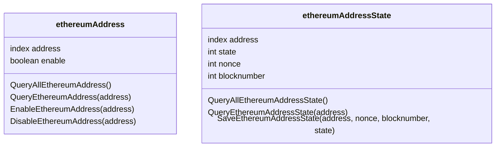
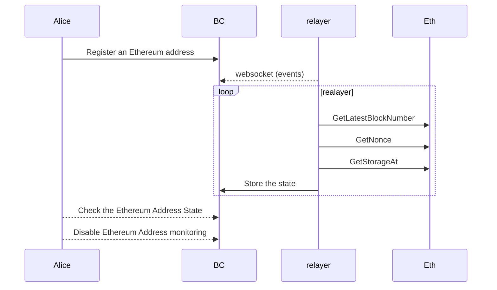

# GOALS
* Your goal is to utilize the Cosmos SDK to build a prototype blockchain that can read state from Ethereum, 
verify its validity, and store it on your chain.

* Your chain should be able to agree upon some Ethereum state.

* The mechanism that facilitates this agreement is up to you.

* Your chain should be able to store the state value for an Ethereum address  + storage slot.

* The address/storage slot pair should be parameterized such that any address/slot 
combination can be stored on your chain.

* Once some storage value is agreed upon,
it should be stored on your blockchain along with any necessary metadata that can be used to identify it.

* Users should be able to read data this from your blockchain.


# architecture

* Maps, attributes e messages



* Sequence diagram




## features

* create map Ethereum addresses (index) and the monitoring status(boolean)

* enable Ethereum address monitoring and create event

* disable Ethereum address monitoring and create event

* Get Ethereum address and the monitoring status

* List Ethereum addresses and monitoring status

* create map Ethereum addresses (index), nonce block number and state

* Save Ethereum *address storage position* (state) with the block number and nonce

* Get Ethereum state from blockchain

* List Ethereum states for addresses


# Components

## Blockchain

The Blockchain server, map and messages were created using ignite.
Is the main component where the state is stored as the address to monitor.

Every time an address is changed to be monitored or not monitored, it creates an event.

The blockchain is at ./ether-state


## Relayer

The Relayer is responsible for sending the state to the blockchain.
It gets the data from the Ethereum blockchain and stores it in the state.

During the start, the Relayer get all address from the blockchain and enable the monitor if is enabled.

Every time the Address monitoring is changed is generated and event in the blockchain.

The Relayer is listening to the events for `MsgEnableEthAddress` and `MsgDisableEthAddress`, and updates the list of addresses to monitor.
The WebSocket client used was the `gorilla`, since the Tendermint was not working (the development was done at windows+wsl)

The status is updated every 10 Secondd(similar to the block time).

The Relayer is at ./relayer


# future improvements
* The Relayer could be listing events from Ethereum to check when the address is changed.
    * This reduces a lot the amount of requests to Infura and the number of state/blockNumber/nonce updates.
* Validate the address is from smart contract.
    * Validating from the blockchain could create some side effects
    * The relayer could add a stamp to the address
* Blockchain attack
* Request code auditing
* replace gorilla by Tendermint websocket
* Create CI/CD
* Create configurations for differents environments
* Create more tests (unit,integration,performane, cornercase),
* Run Linters 
* create quality gates
* containarization of blockchain and relayer
* CI/CD bots to notify for update dependencies and vulnerabilities
* analize the relayer integrated with the blockchain

# main code 
## blockchain
[msg_server_disable_eth_address.go](ether-state/x/etherstate/keeper/msg_server_disable_eth_address.go)
[msg_server_enable_eth_address.go](ether-state/x/etherstate/keeper/msg_server_enable_eth_address.go)

[msg_server_save_ethereum_address_state.go](ether-state/x/etherstate/keeper/msg_server_save_ethereum_address_state.go)

[errors.go](ether-state/x/etherstate/types/errors.go)

## Relayer
[Relayer](./relayer/main.go)


# required tools
https://docs.ignite.com/guide/getting-started
git
golang

# init demo chain

init `statether`
```shell
ignite scaffold chain ether-state
```
expect output
```shell
⭐️ Successfully created a new blockchain 'ether-state'.
👉 Get started with the following commands:

```

start the blockchain with
```shell
cd ether-state
ignite chain serve

```

expected output
```shell
🌍 Tendermint node: http://0.0.0.0:26657
🌍 Blockchain API: http://0.0.0.0:1317
🌍 Token faucet: http://0.0.0.0:4500
```


# used commands for ignite boilerplate

```shell

ignite scaffold chain github.com/nelsonstr/o3n1/ether-state 

ignite generate ts-client

cd ether-state

# start with `hot deploy`
ignite chain serve -v

# start in debug mode
ignite chain debug --server --server-address 127.0.0.1:30500

```

```shell
# create map for ethereum addresses and 

# eth address is the index
ignite scaffold map ethereum-address active:bool \
    --index index \
    --module ether-state \
    --no-message

# add address
ignite scaffold message enable-eth-address  address --response success:bool --module ether-state
ignite scaffold message disable-eth-address address --response success:bool --module ether-state


ignite scaffold map ethereum-address-state state:uint block:uint nonce:uint --index index --module ether-state --no-message
```

### command to create the scaffold

* create map for monitoring status

```shell
go build -o ether-state cmd/ether-stated/main.go

./ether-state query etherstate list-ethereum-address
./ether-state query etherstate list-ethereum-address-state

./ether-state tx etherstate enable-eth-address 0xe8aCaaB95d1102D099F82F03f6106289ee19abA8  --from cosmos10wtz2ckpzzgek0n4w4mpy4mrrnpwu3zx6nxm32 --gas auto  
./ether-state query etherstate show-ethereum-address  0xe8aCaaB95d1102D099F82F03f6106289ee19abA8

./ether-state tx etherstate disable-eth-address 0xe8aCaaB95d1102D099F82F03f6106289ee19abA8  --from cosmos10wtz2ckpzzgek0n4w4mpy4mrrnpwu3zx6nxm32 --gas auto  
./ether-state query etherstate show-ethereum-address  0xe8aCaaB95d1102D099F82F03f6106289ee19abA8

```

* create map to save the state 

```shell
# eth address is the index
ignite scaffold map ethereum-address-state state:uint blockNumber:uint nonce:uint \
    --index index \
    --module ether-state \
    --no-message

```

* create message to store the address state
```shell
ignite scaffold message save-ethereum-address-state address blockNumber:uint nonce:uint storage-position:uint \
    --response success:bool \
    --module ether-state
```

### command save state of ethereum address
```shell
# build
go build -o ether-state cmd/ether-stated/main.go

```

* command line to enable an address
```
./ether-state tx etherstate enable-eth-address 0xe8aCaaB95d1102D099F82F03f6106289ee19abA8  --from cosmos1g5u6nm433jwpa2advpzrp80xpesnw3am3fxfek --gas auto  

```

* command line to save the state and query for and address
```
# save state
./ether-state tx etherstate save-ethereum-address-state  0x3fC91A3afd70395Cd496C647d5a6CC9D4B2b7FAD 10 10 10 --from cosmos1g5u6nm433jwpa2advpzrp80xpesnw3am3fxfek --gas auto
./ether-state query etherstate show-ethereum-address-state  0xe8aCaaB95d1102D099F82F03f6106289ee19abA8

```

* command line list the data for all address
```
# list all 
./ether-state query etherstate list-ethereum-address

./ether-state query etherstate list-ethereum-address-state
```

* command line show the data for one address
```shell

./ether-state query etherstate show-ethereum-address 0x3fC91A3afd70395Cd496C647d5a6CC9D4B2b7FAD

./ether-state query etherstate show-ethereum-address-state 0x3fC91A3afd70395Cd496C647d5a6CC9D4B2b7FAD
```

Connect to websocket server   
```shell
wscat -c ws://localhost:26657/websocket

{ "jsonrpc": "2.0", "method": "subscribe", "id": 0, "params": {"query": "tm.event = 'Tx'"}} 


{"jsonrpc": "2.0","method": "subscribe", "id": 0,"params": {"query": "message.module = 'etherstate'"}}


{"jsonrpc": "2.0","method": "subscribe", "id": 0,"params": {"query": "message.action = '/etherstate.etherstate.MsgEnableEthAddress'"}}
{"jsonrpc": "2.0","method": "subscribe", "id": 0,"params": {"query": "message.action = '/etherstate.etherstate.MsgDisableEthAddress'"}}
 
```

OpenAPI documentation  http://localhost:1317/

Start local blockchain
```shell
cd ether-state
ignite chain serve
```

Start relayer server
```shell
cd relayer
go run .
```

*  Get some Ethereum state stored on your chain

```shell
./ether-state tx etherstate enable-eth-address 0xe8aCaaB95d1102D099F82F03f6106289ee19abA8  --from cosmos10wtz2ckpzzgek0n4w4mpy4mrrnpwu3zx6nxm32 --gas auto  

```
* Query that storage

Requires the Relayer running to store the state
```shell

./ether-state query etherstate show-ethereum-address-state  0xe8aCaaB95d1102D099F82F03f6106289ee19abA8
```
